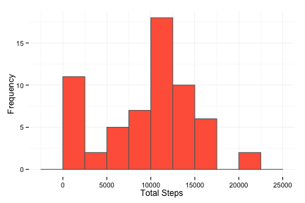
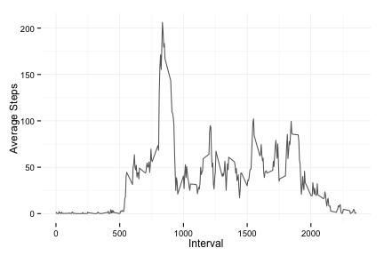
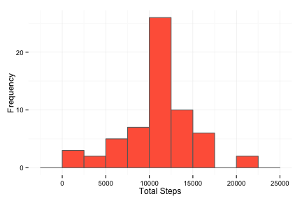
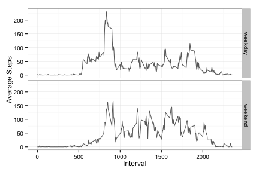

## Loading and preprocessing the data

Load packages. Set options.


```r
library(dplyr)
library(ggplot2)
library(knitr)
opts_chunk$set(echo = TRUE, fig.width = 6, fig.height = 4)
```

Read and process the activity data. Assign date class to **date** column.


```r
## Read file
activity <- read.csv('activity.csv', colClasses = c(NA, 'Date', NA))
```

## What is mean total number of steps taken per day?

Calculate total number of steps taken per day, ignoring NA values, and plot frequency of total steps.


```r
## Summarize daily activity
daily <- activity %>%
    group_by(date) %>%
    summarize(total_steps = sum(steps, na.rm = TRUE))

## Create histogram
ggplot(daily, aes(total_steps)) +
    geom_bar(binwidth = 2500, color = 'dimgrey', fill = 'tomato') +
    xlab('Total Steps') +
    ylab('Frequency') +
    theme_minimal()
```

 

```r
## Calculate mean and median
mean_daily <- mean(daily$total_steps)
median_daily <- median(daily$total_steps)
```

The mean total number of steps taken per day is: 9354.23

The median total number of steps taken per day is: 10395.00

## What is the average daily activity pattern?

Calculate average number of steps taken, averaged across all days, by 5-minute interval, ignoring NA values. Plot average steps over time.


```r
## Summarize activity by interval
interval <- activity %>%
    group_by(interval) %>%
    summarize(avg_steps = mean(steps, na.rm = TRUE))

## Create line plot
ggplot(interval, aes(interval, avg_steps)) +
    geom_line(color = 'dimgrey') +
    xlab('Interval') +
    ylab('Average Steps') +
    theme_minimal()
```

 

```r
## Determine interval with maximum steps
max_steps <- (interval %>% top_n(1, avg_steps))[[1]]
```

Interval 835, on average across all the days in the dataset, contains the maximum number of steps.

## Imputing missing values

Calculate number of missing values.


```r
## Determine records with NA values
missing <- nrow(activity[is.na(activity$steps), ])
```

Total number of missing values: 2304

Fill in missing values with the average steps taken for that 5-minute interval, as calculated above.


```r
## Fill missing values with averages
activity_filled <- merge(activity[is.na(activity$steps), ], interval)
activity_filled$steps <- activity_filled$avg_steps
activity_filled <- rbind(activity_filled %>% select(-avg_steps),
                         activity[!is.na(activity$steps), ])

## Calculate total steps from filled dataset
daily_filled <- activity_filled %>%
    group_by(date) %>%
    summarize(total_steps = sum(steps))

## Create histogram with imputed values
ggplot(daily_filled, aes(total_steps)) +
    geom_bar(binwidth = 2500, color = 'dimgrey', fill = 'tomato') +
    xlab('Total Steps') +
    ylab('Frequency') +
    theme_minimal()
```

 

```r
## Calculate mean and median
mean_filled <- mean(daily_filled$total_steps)
median_filled <- median(daily_filled$total_steps)
```

The mean total number of steps taken per day is: 10766.19

The median total number of steps taken per day is: 10766.19


```r
## Calculate impact
mean_impact <- mean_filled - mean_daily
median_impact <- median_filled - median_daily
```

Filling in missing data increased the mean total number of steps taken per day by: 1411.96

It increased the median total number of steps taken per day by: 371.19

## Are there differences in activity patterns between weekdays and weekends?

Create new variable based on day of week. Calculate and plot average number of steps taken, comparing weekday and weekend activity.


```r
## Create factor column
activity_filled$weekpart <- as.factor(
    ifelse(weekdays(activity_filled$date) %in% c('Saturday', 'Sunday'),
           'weekend', 'weekday'))

## Calculate average steps
interval_filled <- activity_filled %>%
    group_by(weekpart, interval) %>%
    summarize(avg_steps = mean(steps))

## Create line plot
ggplot(interval_filled, aes(interval, avg_steps)) +
    geom_line(color = 'dimgrey') +
    xlab('Interval') +
    ylab('Average Steps') +
    facet_grid(weekpart ~ .) +
    theme_bw()
```

 
